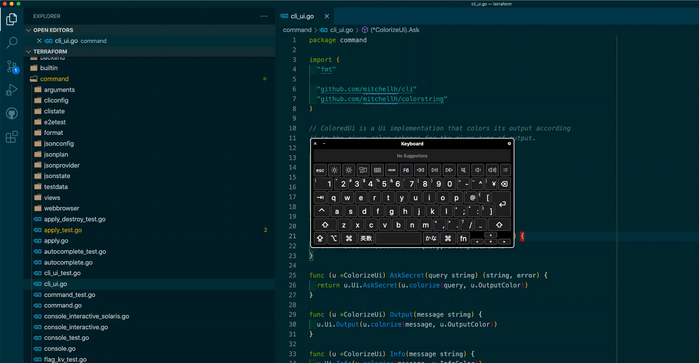

# VSCode Switch Test

This extension adds the ability to switch application code & test code in a moment.
The list of supported test file structure is:

- ./
- ./test
- ./spec
- /test
- /spec



## Usage

1. Open and focus on application code file or test code file.
2. Press ctrl+t.
3. Switch to test code file automatically if open application code file.

## Configuration Example

There are several settings that can be used to configure the extension.

```
{
  "switchTest.testFileSuffix": [
    {
      "extension: ".rb",
      "testFileSuffixes: ["_test", "_spec"]
    },
    {
      "extension: ".go",
      "testFileSuffixes: ["_test"]
    }
  ]
}
```

## Keybinding

You can add your own keybinding in your `keybindings.json`

```
{
  "key": "ctrl+shift+t",
  "command": "extension.switchTest",
}
```
